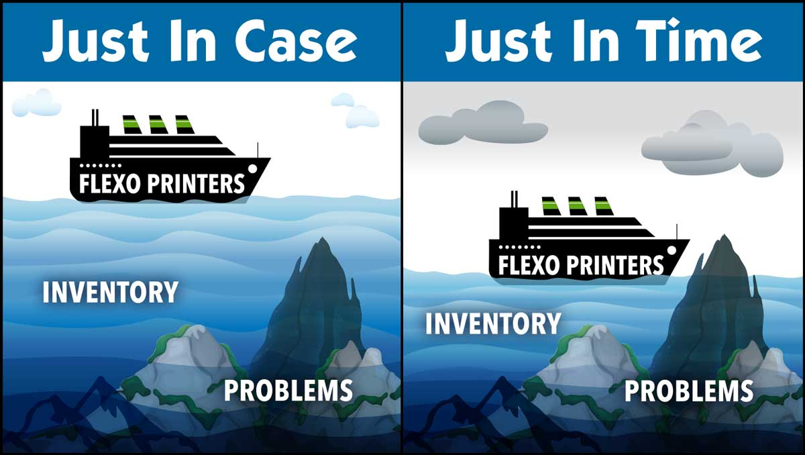

# Optimizing Inventory Management: Just-in-Time vs. Just-in-Case Strategies

## **Introduction**
Effective inventory management is critical for businesses seeking to balance cost efficiency with operational reliability. Two dominant strategies govern inventory control: **Just-in-Time (JIT)** and **Just-in-Case (JIC)**. These approaches offer contrasting philosophies in stock management, each with unique benefits and challenges.

**Just-in-Time (JIT)** aims to minimize inventory levels by ensuring materials and products arrive precisely when needed. Originating from **Toyota’s Lean Manufacturing System**, JIT focuses on waste reduction, lower storage costs, and enhanced operational efficiency. However, its reliance on accurate demand forecasting and dependable suppliers makes it susceptible to supply chain disruptions.

Conversely, **Just-in-Case (JIC)** prioritizes stock availability by maintaining surplus inventory to safeguard against demand fluctuations and supply chain uncertainties. While JIC provides security against shortages, it incurs higher storage costs and the risk of inventory obsolescence.

This article explores the principles, advantages, and limitations of JIT and JIC, providing insights into selecting the optimal inventory strategy based on business needs and industry conditions.

---

## **Understanding Just-in-Time (JIT) and Just-in-Case (JIC)**

### **What is Just-in-Time (JIT)?**

JIT is an inventory strategy where materials and products are procured only when they are required for production or sales. This system eliminates excessive stockholding, optimizing resources and reducing waste.

**Key Characteristics of JIT:**
- Minimal inventory storage
- Strong supplier relationships
- High reliance on demand forecasting
- Increased efficiency and waste reduction

JIT is widely adopted in industries such as **automotive, electronics, and manufacturing**, where precise scheduling and supplier coordination are essential.

---

### **What is Just-in-Case (JIC)?**
JIC involves maintaining excess stock to ensure business continuity despite supply chain disruptions or demand fluctuations. This buffer stock mitigates risks but comes with higher costs.

**Key Characteristics of JIC:**
- Large safety stock
- Reduced risk of stockouts
- Higher storage and capital costs
- Less reliance on real-time supplier coordination

Industries with unpredictable demand, such as **healthcare, retail, and food production**, often favor JIC to avoid shortages that could impact customers and operations.

---

## **Pros and Cons of Each Strategy**

### **Advantages and Disadvantages of JIT**

 **Pros:**
- Lower inventory holding costs, freeing up capital for investment.
- Reduced waste and risk of obsolescence.
- Improved efficiency through streamlined processes and supplier collaboration.
- Encourages continuous improvement and demand-driven production.

 **Cons:**
- High dependency on suppliers, making it vulnerable to disruptions.
- Requires precise demand forecasting to avoid stockouts.
- Limited flexibility in handling sudden demand surges.
- Potential production delays if supply chain inefficiencies arise.

---

### **Advantages and Disadvantages of JIC**

 **Pros:**
- Ensures product availability during demand fluctuations.
- Reduces the risk of supply chain disruptions impacting operations.
- Provides flexibility to handle unexpected orders and seasonal demand shifts.
- Beneficial for industries with long lead times or volatile supply chains.

 **Cons:**
- Higher storage costs due to large stockpiles.
- Risk of inventory obsolescence or spoilage in certain industries.
- More working capital tied up in stock, affecting cash flow.
- Requires significant warehouse space and inventory management resources.

---

## **Choosing the Right Strategy: JIT vs. JIC**
Selecting the most suitable inventory strategy depends on multiple factors, including industry type, supply chain stability, and business priorities.

### **When to Choose JIT:**
- Your supply chain is stable, and suppliers can consistently deliver on time.
- Demand forecasting is accurate and reliable.
- Reducing storage and holding costs is a priority.
- Your industry benefits from lean operations (e.g., **automotive, electronics, manufacturing**).

---

### **When to Choose JIC:**
- Your industry experiences unpredictable demand fluctuations.
- Supply chain disruptions are frequent or difficult to manage.
- Stockouts would significantly impact customer satisfaction or business continuity (e.g., **healthcare, retail, food industries**).
- You have sufficient storage capacity and can manage higher inventory costs.

---

### **Hybrid Approach: The Best of Both Worlds?**
Some businesses integrate elements of both JIT and JIC to balance efficiency and risk mitigation. For example:
- **JIT for predictable items**, while maintaining **JIC as a buffer for high-risk products**.
- **JIT in stable markets** and **JIC in regions with uncertain supply chains**.

Ultimately, the choice between JIT and JIC should align with a company’s **risk tolerance, operational capabilities, and customer expectations**. By strategically assessing inventory needs, businesses can optimize their supply chain for both resilience and efficiency.

---

## **Conclusion**
Both JIT and JIC offer distinct advantages and challenges, making the selection of an inventory strategy highly dependent on business objectives and supply chain conditions.

- **JIT** is ideal for companies looking to **minimize costs, streamline operations, and enhance efficiency**.
- **JIC** provides security in unpredictable markets, ensuring **business continuity despite disruptions**.
- A **hybrid approach** can help businesses achieve a balance between **cost efficiency and risk management**.

Successful inventory management is not about rigid adherence to one approach but rather a **continuous evaluation and adaptation** based on evolving market conditions. By leveraging **technology, data analytics, and supply chain innovations**, businesses can refine their inventory strategies to stay competitive in a dynamic global market.