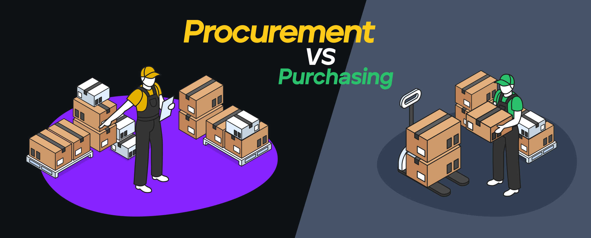
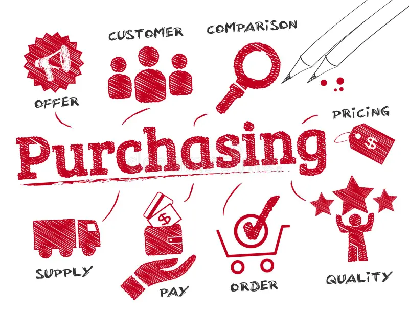
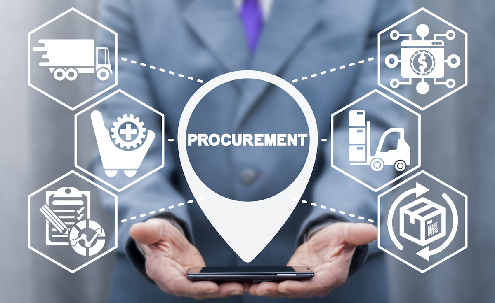
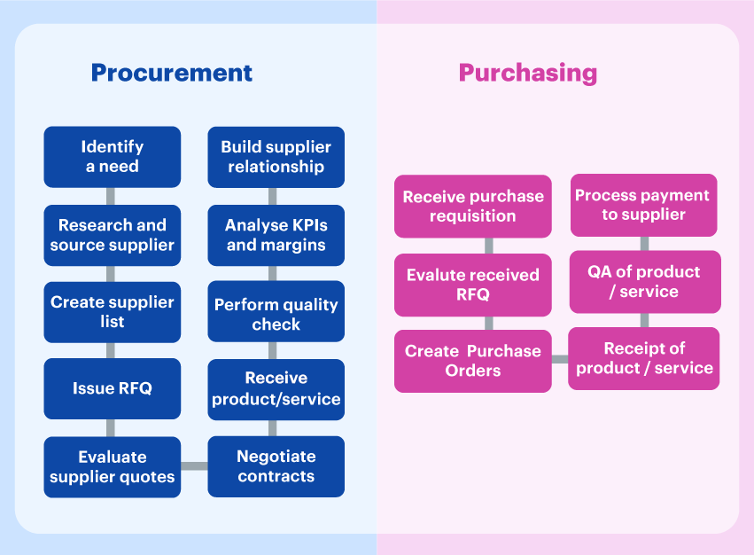

# Purchasing vs. Procurement: Key Differences and Strategic Importance

## Introduction

In business and supply chain management, the terms **purchasing** and **procurement** are often used interchangeably. However, while both involve acquiring goods and services, they differ significantly in scope, objectives, and strategic importance. Understanding this distinction is crucial for businesses looking to optimize costs, improve efficiency, and build strong supplier relationships.

At its core, **purchasing** is a transactional process focused on acquiring goods and services at the best price. It involves order placement, payment processing, and receipt of goods. **Procurement**, on the other hand, takes a broader strategic approach, encompassing supplier selection, contract negotiation, risk management, and long-term value creation.

This article explores the key differences between purchasing and procurement, their respective roles in business operations, and how companies can align both functions to enhance efficiency and competitiveness.

---

## Definitions and Scope

To fully grasp the differences between purchasing and procurement, it is essential to define each term and examine their scope within business operations.

### What is Purchasing?

**Purchasing** refers to the process of acquiring goods or services in exchange for payment. It is a subset of procurement focused on efficiently executing transactions. The purchasing process typically includes:

- Identifying required goods or services
- Requesting and approving purchase orders
- Negotiating prices and payment terms
- Receiving and inspecting goods
- Processing payments and maintaining records

Because purchasing is transactional, it is often a short-term activity aimed at meeting immediate business needs.

---

### What is Procurement?

**Procurement** is a broader, strategic function that includes purchasing but extends beyond simple transactions. It involves sourcing, selecting, and managing suppliers to ensure businesses get the best value, quality, and sustainability in their supply chain. The procurement process typically includes:

- Analyzing business needs and market conditions
- Identifying and evaluating potential suppliers
- Negotiating contracts beyond just pricing (e.g., quality, delivery reliability, risk mitigation)
- Managing supplier relationships and performance
- Ensuring long-term cost efficiency and risk reduction

Unlike purchasing, procurement is a long-term strategic process focused on building strong supplier partnerships, minimizing risks, and optimizing overall supply chain performance.

---

## Key Differences Between Purchasing and Procurement

While purchasing and procurement are closely related, they serve distinct roles in business operations. Their differences can be summarized as follows:

| Feature               | Purchasing | Procurement |
|-----------------------|------------|-------------|
| **Scope**             | Transactional | Strategic |
| **Objective**         | Acquire goods/services quickly at the best price | Optimize cost, quality, and supplier relationships |
| **Process**           | Order placement, payment, and receipt of goods | Supplier selection, contract negotiation, risk management |
| **Timeframe**         | Short-term | Long-term |
| **Supplier Relationship** | Minimal engagement | Strategic, ongoing partnership |
| **Cost Consideration** | Focuses on price per unit | Considers total cost of ownership (TCO) |
| **Decision Criteria** | Based on immediate needs | Aligned with long-term business strategy |
| **Risk Management**   | Limited | Comprehensive, includes mitigation strategies |

---

## The Role of Purchasing and Procurement in Supply Chain and Logistics

Both purchasing and procurement play essential roles in supply chain and logistics, contributing in different ways to operational efficiency and long-term sustainability.

### How Procurement Supports the Supply Chain

Procurement is a strategic function that helps businesses secure reliable suppliers, optimize costs, and mitigate risks. Its role in supply chain management includes:

- **Supplier Selection & Relationship Management**: Ensuring a stable and efficient supply network.
- **Cost Optimization**: Reducing total cost of ownership (TCO) rather than focusing solely on price.
- **Risk Management**: Identifying and mitigating supply chain disruptions (e.g., supplier failures, geopolitical risks).
- **Sustainability & Compliance**: Ensuring ethical sourcing and adherence to industry regulations.
- **Inventory & Demand Planning**: Aligning procurement decisions with production and logistics needs.

---

### How Purchasing Supports Logistics

Purchasing focuses on the operational side of acquiring goods and services, ensuring that materials and products arrive on time and at the right cost. Its role in logistics includes:

- **Ensuring Availability of Supplies**: Ensuring essential materials are ordered and delivered on time.
- **Managing Order Processing & Payments**: Coordinating with suppliers for fast and efficient transactions.
- **Supporting Inventory Management**: Aligning purchases with demand and production requirements.
- **Cost Efficiency in Transactions**: Securing the best possible deals within operational constraints.

---

### Integrating Procurement and Purchasing for Supply Chain Success

To build a resilient and cost-effective supply chain, businesses must align procurement and purchasing strategies. This includes:

- Developing strong supplier partnerships to ensure long-term stability.
- Leveraging data and technology to improve purchasing efficiency and supplier decision-making.
- Balancing cost reduction with quality and reliability to optimize logistics operations.

By integrating procurement and purchasing effectively, businesses can enhance supply chain performance, reduce risks, and achieve long-term competitive advantages.

---

## When to Prioritize Procurement vs. Purchasing

Businesses must determine whether to focus on procurement or purchasing based on operational needs, financial goals, and long-term strategy. While both processes are essential, their emphasis depends on factors such as cost, supplier relationships, and risk management.

### When to Focus on Procurement
A strategic procurement approach is necessary when:

- **High-Value or Long-Term Purchases Are Involved**
  - *Example*: Contracting a supplier for raw materials over multiple years.
  - *Why?* Ensures stable pricing, quality control, and supply continuity.
- **Supplier Relationships Are Critical**
  - *Example*: Partnering with a logistics provider for global shipping.
  - *Why?* Long-term collaboration enhances efficiency and service quality.
- **Risk Management Is a Priority**
  - *Example*: Sourcing from multiple suppliers to reduce dependency on one vendor.
  - *Why?* Reduces supply chain disruptions and ensures business continuity.
- **Total Cost of Ownership (TCO) Matters**
  - *Example*: Procuring machinery where maintenance, efficiency, and long-term costs outweigh the initial price.
  - *Why?* Ensures better value and cost savings over time.
- **Regulatory Compliance and Sustainability Are Key**
  - *Example*: Sourcing materials that meet environmental or ethical standards.
  - *Why?* Ensures compliance with legal and corporate social responsibility (CSR) goals.

---

### When to Focus on Purchasing
A purchasing approach is sufficient when:

- **Immediate Needs Must Be Met Quickly**
  - *Example*: Ordering office supplies or one-time consumables.
  - *Why?* Requires fast transactions without long-term supplier evaluation.
- **Low-Value or Routine Purchases Are Required**
  - *Example*: Buying replacement printer cartridges or maintenance tools.
  - *Why?* The cost of negotiation and procurement strategy outweighs the benefits.
- **There Is No Need for Supplier Relationship Management**
  - *Example*: Ordering from multiple vendors based only on price and availability.
  - *Why?* Supplier collaboration is unnecessary for routine or commodity-based purchases.

---

## Conclusion

While **purchasing** and **procurement** are often used interchangeably, they serve distinct roles in business operations. **Purchasing** is a transactional function focused on acquiring goods and services quickly and cost-effectively, whereas **procurement** takes a strategic approach, emphasizing supplier relationships, risk management, and long-term value creation.

Understanding these differences enables businesses to optimize costs, enhance efficiency, and build resilient supply chains. Companies that effectively integrate procurement and purchasing will gain a competitive advantage and ensure sustainable growth.