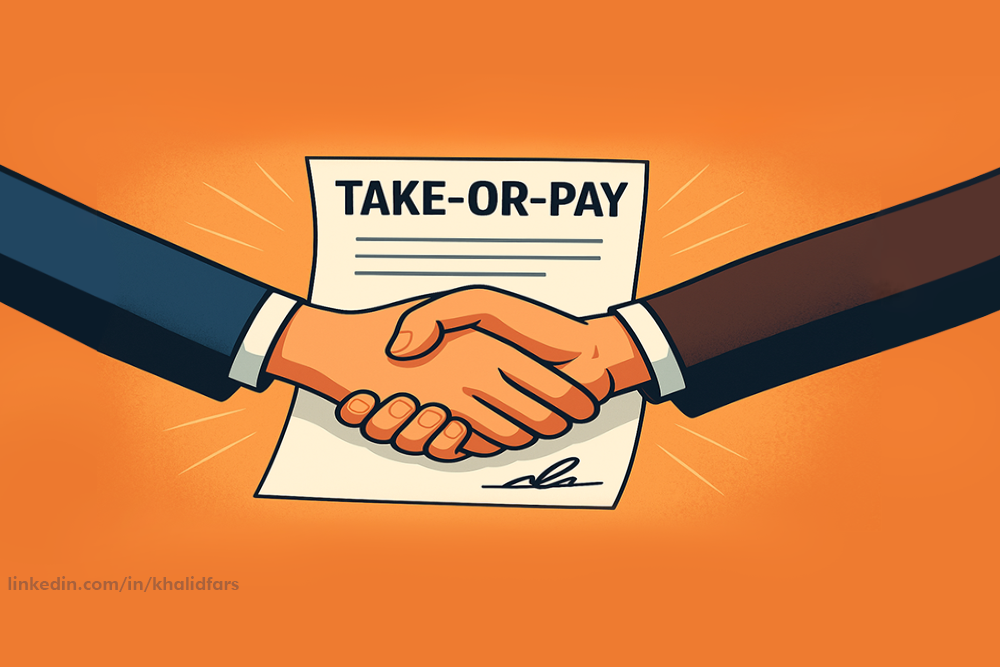
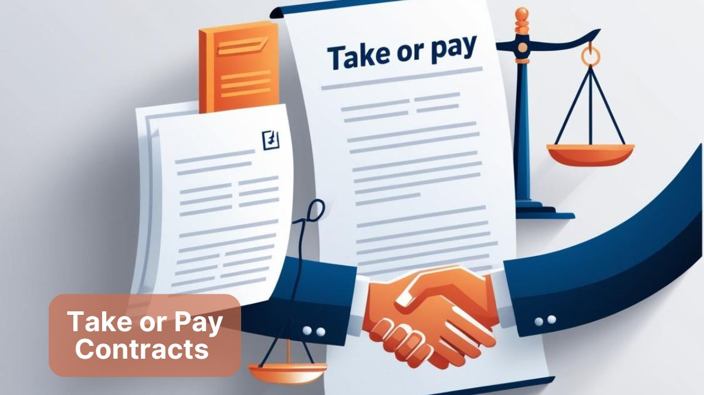
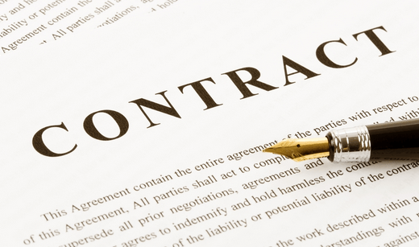

# Take-or-Pay Clauses: Managing Risk and Commitment

## Introduction
In complex B2B transactions, contractual mechanisms are essential to ensure commitment and mitigate financial risk. One such mechanism is the **Take-or-Pay (ToP) clause**, a provision that obligates one party (typically the buyer) to either purchase a minimum quantity of goods or services or pay for them regardless of whether they are taken.

  

This article explores the nature of Take-or-Pay clauses, their applications, variations, benefits, drawbacks, and key considerations for drafting and negotiation.

---

## What is a Take-or-Pay Clause?
A Take-or-Pay clause, also known as a minimum purchase or all-or-nothing clause, transforms uncertainty into calculable risk. It assures the supplier of revenue and production planning security, while offering buyers guaranteed supply and potential price stability.

  

Typically embedded in long-term supply or service agreements, these clauses are common in industries where production costs are high, demand fluctuates, or supplier performance is critical.

---

## Why Businesses Use Take-or-Pay Clauses

### For Suppliers
- **Revenue Assurance:** Ensures income stability even during demand fluctuations.
- **Capacity Utilization:** Prevents underuse of production facilities and idle costs.
- **Cash Flow Stability:** Facilitates predictable budgeting and financial planning.

### For Buyers
- **Securing Supply:** Guarantees availability of goods or services.
- **Price Protection:** May lock in costs and hedge against price volatility.
- **Supplier Commitment:** Provides strong incentives for timely delivery and performance.

---

## Types of Take-or-Pay Clauses

    

### Fixed Price Take-or-Pay
The buyer agrees to pay a predetermined price for a minimum quantity, whether or not it is taken. Clarity on what constitutes "available" or "deliverable" goods is essential.

### Variable Price Take-or-Pay
Pricing may include fixed and variable components, with adjustments linked to market conditions. This structure adds complexity but offers flexibility in volatile markets.

### Minimum Quantity Take-or-Pay
The buyer commits to a baseline purchase quantity, beyond which standard terms apply. This balances flexibility with revenue assurance for suppliers.

---

## Key Obligations in Take-or-Pay Contracts

    

### Buyer Obligations
- Define goods or services considered "available" for delivery and payment.
- Specify payment triggers and timing requirements.
- Ensure minimum purchase commitments align with realistic demand projections.
- Establish clear notification procedures for availability and delivery.

### Supplier Obligations
- Define minimum production or delivery commitments.
- Establish transparent pricing mechanisms-fixed, variable, or indexed.
- Plan capacity and inventory to avoid surplus or overproduction risks.

---

## Advantages and Disadvantages

### Advantages for Suppliers
- Predictable revenue stream.
- Protection against underutilized production capacity.
- Better operational and financial planning.

### Advantages for Buyers
- Reliable access to supply.
- Potential price stability over contract duration.
- Stronger supplier performance incentives.

### Disadvantages for Buyers
- Upfront or minimum payments may strain cash flow.
- Risk of paying for goods or services that remain unused.
- Exposure to financial loss if demand forecasts are inaccurate.

### Disadvantages for Suppliers
- Exposure to losses if fixed prices become uncompetitive.
- Potential overproduction risks in volatile markets.
- Possible misuse of clause by dominant buyers to control supply.

---

## When Are Take-or-Pay Clauses Appropriate?

    

These clauses are common in industries where production involves high capital costs or demand is uncertain:
- Energy (oil, gas, power generation)
- Commodities (agriculture, metals)
- Manufacturing (critical components, raw materials)
- Logistics and infrastructure projects

They are less common in consumer goods or short-term contracts where demand is stable and credit arrangements can mitigate risk.

---

## Best Practices for Drafting and Negotiating ToP Clauses

1. **Ensure Clarity of Terms**  
   Define minimum quantities, pricing frameworks, delivery obligations, and payment schedules.

2. **Align Risk Allocation**  
   Share risks fairly between parties and include provisions for unexpected market shifts.

3. **Include Performance and Quality Safeguards**  
   Tie payment obligations to performance standards and product quality.

4. **Seek Legal and Financial Review**  
   Engage legal counsel and financial advisors to evaluate implications before finalizing agreements.

---

## Example Scenario

A manufacturer sources raw materials from an overseas supplier. Demand is seasonal, and production requires long lead times. A Take-or-Pay clause guarantees the supplier receives payment for a minimum quantity, ensuring financial stability and capacity maintenance, while the manufacturer secures continuous supply despite fluctuations in actual purchases.

---

## Conclusion

    

The Take-or-Pay clause is a powerful contractual mechanism that provides financial security, operational predictability, and mutual commitment in commercial agreements. However, its benefits come with obligations that can affect cash flow and risk exposure.  

Clear drafting, fair pricing, and strong legal safeguards are essential to ensure that the clause serves as a tool for risk management rather than a source of disputes. When applied thoughtfully, Take-or-Pay agreements can strengthen partnerships and support long-term business resilience.
